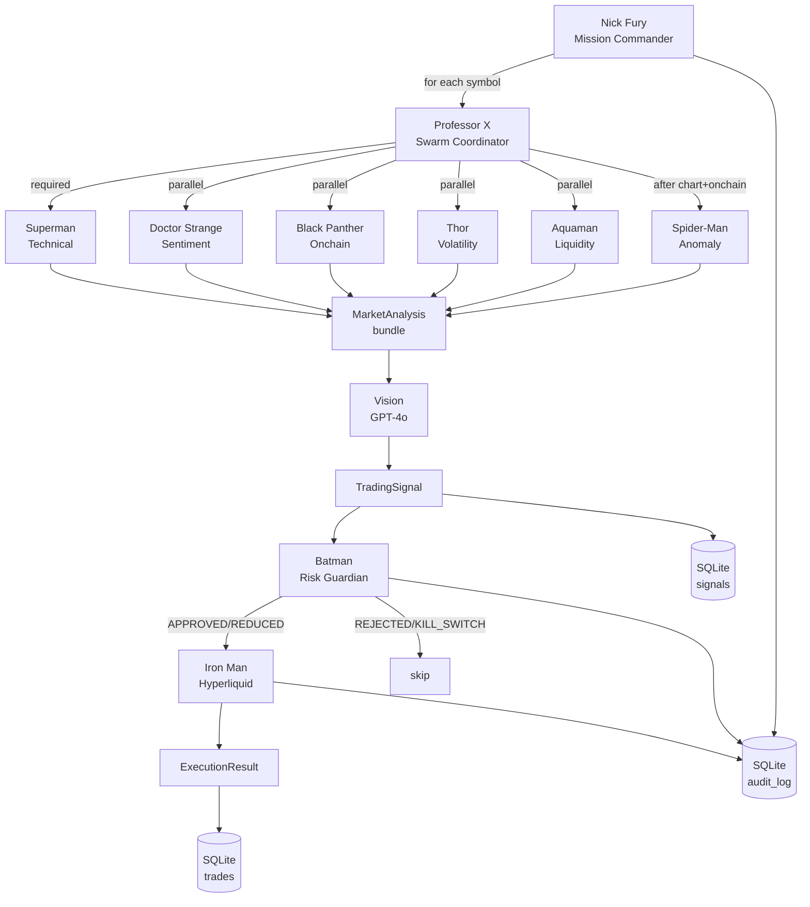

# Mekka Trading — Architecture (Living Document)

Este documento descreve **como o sistema funciona hoje**. Não é
roadmap, não é vision — é a fotografia atual da arquitetura. Atualize
sempre que uma story mudar inputs/outputs ou bordas de responsabilidade.

Última revisão: Story 025 (pipeline estratégico Python end-to-end).

---

## 1. Princípios

- **CLI-first** — tudo se invoca por `run.py` (Python) ou `node dist/cli/*.js` (TS).
- **Risk-first** — Batman é gate intransponível antes de qualquer execução.
- **Observability-first** — todo evento relevante grava em audit log + emite log estruturado.
- **Paper-first** — `paper_trading=True` por default; live exige decisão humana explícita.
- **Modular por agente** — cada agente Marvel é uma unidade cognitiva isolada com input/output Pydantic.

## 2. Fluxo principal — workflow obrigatório

```
INPUT → ANALYSIS → DECOMPOSITION → ROUTING → EXECUTION → VALIDATION → REFLECTION → OUTPUT
```

Mapeamento das fases para o pipeline Python:

| Fase           | Implementação                                                    |
| -------------- | ---------------------------------------------------------------- |
| INPUT          | `NickFury.run_main_cycle(equity_usd)` itera `settings.trading_assets` |
| ANALYSIS       | `ProfessorX.run(symbol)` → fan-out paralelo Layer-1              |
| DECOMPOSITION  | `MarketAnalysis` agrega 6 outputs e expõe `is_safe_to_trade`     |
| ROUTING        | `Vision.run(analysis)` decide LONG/SHORT/HOLD                    |
| EXECUTION      | `IronMan.run(signal, approval, equity)` (paper ou live)          |
| VALIDATION     | `Batman.run(signal, ...)` antes de Iron Man                      |
| REFLECTION     | `MekkaRepository.log_event(...)` + audit_log SQLite              |
| OUTPUT         | `CycleReport` retornado por NickFury                             |

## 3. Diagrama de pipeline



## 4. Agentes — contrato I/O

Cada agente é uma classe Python que herda de `BaseAgent[T]` com método
async `_run(...) -> T`. O wrapper `run()` adiciona timing, logging e
normalização de erros.

### Layer 1 — Market Analysis

| Agente         | Input                                        | Output Pydantic       | Deps externas              |
| -------------- | -------------------------------------------- | --------------------- | -------------------------- |
| Superman       | `symbol: str, timeframe?: str`               | `MarketData`          | CCXT (Hyperliquid/Binance) |
| Doctor Strange | `symbol: str = "BTC"`                        | `SentimentData`       | CryptoPanic, F&G, CG       |
| Black Panther  | `symbol: str`                                | `OnchainData`         | Hyperliquid `/info`        |
| Thor           | `market_data: MarketData, price_history?`    | `VolatilityData`      | nenhuma (cálculo puro)     |
| Aquaman        | `symbol: str`                                | `LiquidityData`       | Hyperliquid `/info` (L2)   |
| Spider-Man     | `symbol, market_data, onchain_data?`         | `AnomalyReport`       | nenhuma (cálculo puro)     |

### Layer 2 — Strategy

| Agente       | Input                              | Output Pydantic   | Deps externas |
| ------------ | ---------------------------------- | ----------------- | ------------- |
| Professor X  | `symbol: str`                      | `MarketAnalysis`  | (orquestra L1) |
| Vision       | `analysis: MarketAnalysis`         | `TradingSignal`   | OpenAI GPT-4o  |

### Layer 3 — Risk & Execution

| Agente   | Input                                                  | Output Pydantic    | Deps externas              |
| -------- | ------------------------------------------------------ | ------------------ | -------------------------- |
| Batman   | `signal, volatility?, liquidity?, drawdown, positions, trades_today` | `RiskApproval` | nenhuma (puro determinismo) |
| Iron Man | `signal, approval, equity_usd`                         | `ExecutionResult`  | hyperliquid-python-sdk (live only) |

### Layer 4 — Command & Control

| Agente            | Input                          | Output Pydantic       | Deps externas              |
| ----------------- | ------------------------------ | --------------------- | -------------------------- |
| Nick Fury         | `equity_usd?: Optional[float]` | `list[CycleReport]`   | (orquestra L1–L3 + L4 PM + DailyPnLWriter)  |
| Portfolio Manager | (none — reads settings)        | `EquitySnapshot`      | aiohttp → Hyperliquid /info (read-only) |

### Services (não-agente)

| Service            | Input                                     | Output Pydantic/dataclass | Deps externas |
| ------------------ | ----------------------------------------- | ------------------------- | ------------- |
| `DailyPnLWriter`   | `equity_usd, trades_count_today, snapshot?` | `DailyPnLSnapshot`        | `Repository.upsert_daily_pnl` |

### Heróis pendentes (Story 027+)

| Agente    | Input planejado                  | Output planejado    | Status |
| --------- | -------------------------------- | ------------------- | ------ |
| Wolverine | (positions snapshot + market)    | RecoveryPlan        | pendente |
| Flash     | `MarketData + tick stream`       | `MomentumSignal`    | pendente |
| Deadpool  | `historical signals + trades`    | BacktestReport      | pendente |

## 5. Models Pydantic — contratos de dados

| Model               | Arquivo                       | Quem produz       | Quem consome           |
| ------------------- | ----------------------------- | ----------------- | ---------------------- |
| `Candle`            | `models/market_data.py`       | (utilitário)      | -                      |
| `MarketData`        | `models/market_data.py`       | Superman          | Thor, Spider-Man, MA   |
| `SentimentData`     | `models/market_data.py`       | Doctor Strange    | MarketAnalysis         |
| `OnchainData`       | `models/market_data.py`       | Black Panther     | Spider-Man, MA         |
| `VolatilityData`    | `models/market_data.py`       | Thor              | Batman, MarketAnalysis |
| `LiquidityData`     | `models/market_data.py`       | Aquaman           | Batman, MarketAnalysis |
| `AnomalyReport`     | `models/market_data.py`       | Spider-Man        | MarketAnalysis         |
| `MarketAnalysis`    | `models/market_data.py`       | Professor X       | Vision                 |
| `TradingSignal`     | `models/signal.py`            | Vision            | Batman, Iron Man, DB   |
| `MomentumSignal`    | `models/signal.py`            | Flash (futuro)    | Vision (futuro)        |
| `MarketRegime`      | `models/signal.py`            | Professor X (futuro) | Batman (futuro)     |
| `RiskApproval`      | `models/risk.py`              | Batman            | Iron Man, audit_log    |
| `ExecutionResult`   | `models/execution.py`         | Iron Man          | Repository, audit_log  |
| `PositionSummary`   | `models/portfolio.py`         | Portfolio Manager | (consumed in EquitySnapshot) |
| `EquitySnapshot`    | `models/portfolio.py`         | Portfolio Manager | Nick Fury, Batman, audit_log |

**Convenções:**

- Toda timestamp é UTC (`datetime.now(timezone.utc)`).
- Toda quantidade monetária é USD em `float`.
- Toda fração é `0.0–1.0` (não 0–100), exceto `fear_greed_index` (0–100).
- `to_prompt_section()` em models de análise serializa para LLM prompt.

## 6. Persistência (SQLite)

Path: `data/mekka_trading.db` (configurável via `settings.sqlite_db_path`).

Engine: SQLAlchemy 2.x async + aiosqlite. DDL automático na primeira
inicialização (`MekkaRepository.initialize()`).

| Tabela       | Quem escreve            | Quem lê                            |
| ------------ | ----------------------- | ---------------------------------- |
| `signals`    | Nick Fury (após Vision) | Repository.list_recent_signals     |
| `trades`     | Nick Fury (após Iron Man) | Repository.count_trades_today    |
| `daily_pnl`  | DailyPnLWriter (fim de cycle) | Batman → Repository.get_today_drawdown_pct |
| `audit_log`  | qualquer agente via NF  | Dashboard, futuro Deadpool         |

## 7. Ponte TypeScript ↔ Python

Os dois lados coexistem hoje sem fonte única de verdade. Cada um é dono
da sua superfície:

| Conceito         | Fonte de verdade hoje                  | Mirror existente?           |
| ---------------- | -------------------------------------- | --------------------------- |
| Mission planner  | TS (`workflows/mission-planner.ts`)    | não                         |
| Squad router     | TS (`workflows/squad-router.ts`)       | não                         |
| Megazord runtime | TS (`workflows/megazord-runtime.ts`)   | Python = pipeline novo (NickFury) — coexistente, NÃO duplicado |
| Risk Engine      | TS (`risk-engine/risk-engine.ts`) — limites operacionais; **Batman (Python) é o gate de runtime** | Batman delega aos limites em settings, que espelham os do TS |
| Audit log        | TS (`memory/*.ndjson`) **E** Python (SQLite `audit_log`) | dual — single source pendente (Story 028) |
| Hyperliquid mock | TS (`exchanges/hyperliquid/`)          | Python usa SDK real (paper) |
| Strategy engine  | TS (`strategy-engine/`)                | Python (Vision + Layer 1)   |

**Regra de duplicação:** quando uma feature existe dos dois lados,
documente aqui qual é o autoritativo e qual é mirror. Não crie um
terceiro caminho.

## 8. Observability

### Logs (loguru)

Configurado em `run.py::_configure_logger()`. Formato:

```
2026-05-07 18:09:12 | INFO     | Vision         | [BTC] LONG @ 65,000 ...
```

Toda subclasse de `BaseAgent` ganha `self._log = logger.bind(agent=codename)`.

### Audit log (SQLite)

`audit_log` table. Eventos canônicos:

- `BOOT` — Nick Fury inicializou
- `SHUTDOWN` — pipeline encerrado
- `CYCLE_SKIPPED` — kill switch ou erro grave abortou ciclo
- `CYCLE_ERROR` — exceção em um símbolo
- `MONITOR_HEARTBEAT` — monitor cycle rodou
- `RISK_<verdict>` — Batman emitiu verdict (APPROVED/REDUCED/REJECTED/KILL_SWITCH)
- `EXEC_<status>` — Iron Man executou (FILLED/PARTIAL/PAPER/REJECTED/ERROR/SKIPPED)

### Audit log (TypeScript — legado)

`memory/*.ndjson` produzidos pelo Megazord runtime. Não tocar a
estrutura; deixar como está até a Story 028 unificar.

## 9. Storage layout

```
data/
├── mekka_trading.db        # SQLite — signals/trades/daily_pnl/audit_log
└── .kill_switch            # arquivo flag — quando existe, Batman para tudo

memory/
├── *.events.ndjson         # eventos do Megazord runtime (TS)
├── *.audits.ndjson         # auditoria do Megazord runtime (TS)
├── alerts/                 # ops alerting (TS)
└── reports/                # mission reports (TS)

observability/
├── store/                  # event store TS
├── alerts/                 # alert dispatcher + retry + DLQ (TS)
└── reports/                # mission reports (TS)
```

## 10. Settings cheatsheet

| Env var                      | Default        | Onde lê                          |
| ---------------------------- | -------------- | -------------------------------- |
| `OPENAI_API_KEY`             | (obrigatório)  | Vision                           |
| `OPENAI_MODEL`               | `gpt-4o`       | Vision                           |
| `OPENAI_TEMPERATURE`         | `0.2`          | Vision                           |
| `HYPERLIQUID_PRIVATE_KEY`    | (obrigatório)  | Iron Man (live)                  |
| `HYPERLIQUID_WALLET_ADDRESS` | (obrigatório)  | Iron Man (live)                  |
| `HYPERLIQUID_NETWORK`        | `testnet`      | Iron Man, Black Panther, Aquaman |
| `PAPER_TRADING`              | `true`         | Iron Man                         |
| `TRADING_ASSETS`             | `BTC,ETH,SOL`  | Nick Fury                        |
| `MAX_POSITION_SIZE_PCT`      | `0.02`         | Batman                           |
| `MAX_LEVERAGE`               | `5`            | Batman                           |
| `MAX_DAILY_DRAWDOWN_PCT`     | `0.10`         | Batman                           |
| `MIN_CONFIDENCE_THRESHOLD`   | `0.65`         | Batman                           |
| `MIN_RISK_REWARD_RATIO`      | `1.5`          | Batman                           |
| `MAIN_LOOP_INTERVAL_SECONDS` | `14400`        | Nick Fury (run_forever)          |
| `MONITOR_INTERVAL_SECONDS`   | `300`          | Nick Fury (run_forever)          |
| `MEKKA_KILL_SWITCH`          | (vazio)        | Batman.is_kill_switch_active     |
| `SQLITE_DB_PATH`             | `data/mekka_trading.db` | Persistence              |
| `PAPER_EQUITY_USD`           | `10000.0`      | Portfolio Manager (paper fallback) |
| `TELEGRAM_BOT_TOKEN`         | (vazio)        | (futuro)                         |
| `TELEGRAM_CHAT_ID`           | (vazio)        | (futuro)                         |
| `CRYPTOPANIC_API_KEY`        | (vazio)        | Doctor Strange (opcional)        |
| `LOG_LEVEL`                  | `INFO`         | run.py                           |

## 11. Como o pipeline morre com graça

1. `KeyboardInterrupt` em `run_forever()` → loop sai → `NickFury.shutdown()` chama `professor.close()` + `vision.close()`.
2. `Batman.run` retorna `KILL_SWITCH` → cycle skipped → próximo ciclo verifica novamente o flag.
3. `Vision._call_llm` falha → `_fallback_hold` retorna sinal HOLD seguro → Batman recebe HOLD → REJECTED.
4. `IronMan._place_live_order` esgota retries → `ExecutionStatus.ERROR` retornado → audit_log grava → próximo símbolo continua.

Nenhum caminho propaga exceção até o topo do loop. Todas as falhas
viram dado estruturado.

## 12. Quando atualizar este arquivo

- Quando uma story mudar input/output de qualquer agente.
- Quando criar um novo agente.
- Quando adicionar/remover settings.
- Quando alterar a fonte-de-verdade entre TS e Python.
- Quando criar uma nova tabela SQLite.

Se mudou comportamento e este arquivo não foi atualizado, a story está
incompleta.
